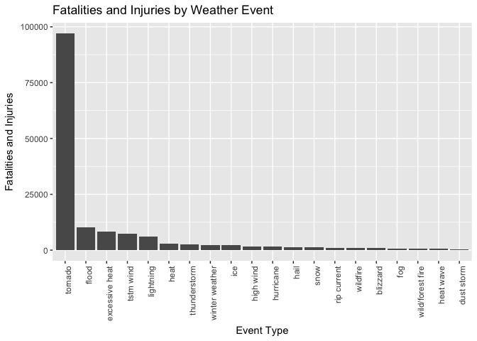
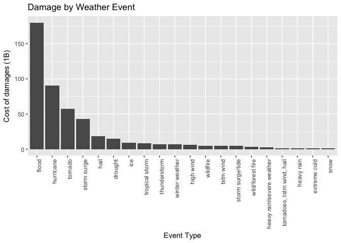

# Health and Economic Impact of Weather Events in the USA

Reproducible Data Assignment 2
==============================

The goal of this assignment is to explore the NOAA Storm Database and answer two questions about severe weather events:

1. Across the United States, which types of events (as indicated in the *evtype* variable) are most harmful with respect to population health?
2. Across the United States, which types of events have the greatest economic consequences?

# Synopsis

Based on this analysis tornadoes are the number one weather related health threat.
Floods are the number one cause of econmic damage. 
In both cases, the analysis shows that these events far outweigh the impact of
other weather events measured.

This analysis was performed using the NOAA Storm database. Data was grouped and 
summarized by evtype which denotes a specific type of weather event. Health impact
was caclulated by summing the injuries and fatalities caused by each type of weather 
event. Economic impact was determined by summing the total dollar damage to property
and crops for each weather event type.

### Analysis summarizing the data by weather events types:

* Tornados have the most impact on population health causing the most injuries and fatalities.
* Floods generate the most economic damage.

# Data Processing


## Load the data

Download the dataset and load it into a dataframe.


```r
library(plyr)
library(ggplot2)
url <- "https://d396qusza40orc.cloudfront.net/repdata%2Fdata%2FStormData.csv.bz2"
destfile <- "stormdata.csv.bz2"
if (!file.exists(destfile)) {
        download.file(url = url, destfile = destfile, method = "curl")
}

data <- read.csv(destfile)
```

## Preprocess the data

Tidy the column names by making them lowercase. 

The "evtype" column has numerous issues:

* Misspellings
* Mix of lowercase and uppercase values
* Mix of plural and singular names
* Mix of specific events such as "hurricane *name*" mixed with event types

The following code corrects these issues.


```r
tidyData <- data
## convert column names to lowercase
colnames(tidyData) <- tolower(colnames(tidyData))

## evtype names are both UPPER and lowercase make them all lowercase for grouping
tidyData$evtype <- trimws(tolower(tidyData$evtype), c("both"))
## Some events are plural, convert plural to singular events
tidyData$evtype <- ifelse (grepl(".*s$", tidyData$evtype),
                             substr(tidyData$evtype, 1, nchar(tidyData$evtype) - 1), 
                             tidyData$evtype)
## Convert all versions of flood to flood
tidyData$evtype <- ifelse (grepl("flood", tidyData$evtype), 
                             "flood",
                             tidyData$evtype)
## Convert all versions of hurriance to huricane
tidyData$evtype <- ifelse (grepl("hurricane", tidyData$evtype), 
                             "hurricane", 
                             tidyData$evtype)
## Convert all versions of thunderstorm to thunderstorm
tidyData$evtype <- ifelse (grepl("thunder", tidyData$evtype), 
                             "thunderstorm", 
                             tidyData$evtype)
## Convert all versions of ic* to ice
tidyData$evtype <- ifelse (grepl("^ic", tidyData$evtype), 
                             "ice", 
                             tidyData$evtype)
## Convert all versions of wint* to winter weather
tidyData$evtype <- ifelse (grepl("^wint", tidyData$evtype), 
                             "winter weather", 
                             tidyData$evtype)
## Convert all versions of snow to snow
tidyData$evtype <- ifelse (grepl("snow", tidyData$evtype), 
                             "snow", 
                             tidyData$evtype)
```
# Results

## Which types of events (as indicated in the *evtype* variable) are most harmful with respect to population health?

We have data which gives us counts for injuries and fatalities for each event type. We'll group by evtype across all observations and sum injuries and fatalities.

Next we'll create a new value which is the sum of injuries + fatalities for each evtype.

```r
## Subset of columns for mapping events to health
healthColumns <- c("evtype","fatalities", "injuries")
healthData <- tidyData[healthColumns]

healthSummary <- ddply(healthData, .(evtype), numcolwise(sum))
healthSummary$injury_death <- healthSummary$fatalities + healthSummary$injuries
healthSummary <- subset(healthSummary, healthSummary$injury_death > 0)
healthSummary <- healthSummary[order(healthSummary$injury_death,decreasing = T),]
```
### 97% of all injuries and deaths are caused by 20 event types. Let's focus on those top 20 events.

```r
## Get the top 20
top20 <- healthSummary[1:20,]
sum(top20$injury_death) / sum(healthSummary$injury_death) * 100
```

```
## [1] 96.69114
```
### Most fatalities and injuries are from Tornadoes


```r
top20$events <- factor(top20$evtype, levels=top20$evtype, ordered=TRUE)
g <- ggplot(top20, aes(x=as.factor(events),y=injury_death)) +
        labs(x = "Event Type") + 
        labs(y = "Fatalities and Injuries") +
        labs(title = "Fatalities and Injuries by Weather Event") +
        geom_bar(stat = "Identity") + 
        theme(axis.text.x = element_text(angle = 90, hjust = 1))
print(g)
```

<!-- -->

## Across the United States, which types of events have the greatest economic consequences?

Convert property and crop damage to dollar values. Create a new column total damage
which is the sum of property and crop damage. Sum total damage by evtype.

Focus on the most damaging weather events.

```r
## Convert property and crop damage to dollar values
propdmgexp <- c("", "H", "K", "M", "B")
propmultiple <- c(1, 100, 1000, 1000000, 1000000000)
multiples <- cbind(propdmgexp, propmultiple)
propertyData <- merge(tidyData, multiples, by="propdmgexp")
propertyData$propdmg_m <- propertyData$propdmg * 
        as.numeric(as.character(propertyData$propmultiple))
cropdmgexp <- c("", "H", "K", "M", "B")
cropmultiple <- c(1, 100, 1000, 1000000, 1000000000)
multiples <- cbind(cropdmgexp, cropmultiple)
propertyData <- merge(propertyData, multiples, by="cropdmgexp")
propertyData$cropdmg_m <- propertyData$cropdmg * 
        as.numeric(as.character(propertyData$cropmultiple))

## Create new column with total dollar damage to both crops and property
propertyData$totaldmg <- propertyData$propdmg_m + propertyData$cropdmg_m

## Group dollar damagae by evtype
propertySummary <- ddply(propertyData, .(evtype), numcolwise(sum))

## Order events by damage amount
propertySummary <- propertySummary[order(propertySummary$totaldmg,decreasing = T),]
```
### 98% of all damage is done by the top 20 events, let's focus on those

```r
## Take the top 20 dollar amount damage evtype values
top20 <- propertySummary[1:20,]
sum(top20$totaldmg) / sum(propertySummary$totaldmg) * 100
```

```
## [1] 98.35146
```
### Flood is the leading cause of property and crop damage

```r
top20$events <- factor(top20$evtype, levels=top20$evtype, ordered=TRUE)
g <- ggplot(top20, aes(x=as.factor(events),y=totaldmg/10^9)) +
        labs(x = "Event Type") + 
        labs(y = "Cost of damages (1B)") +
        labs(title = "Damage by Weather Event") +
        geom_bar(stat = "Identity") + 
        theme(axis.text.x = element_text(angle = 90, hjust = 1))
print(g)
```

<!-- -->
